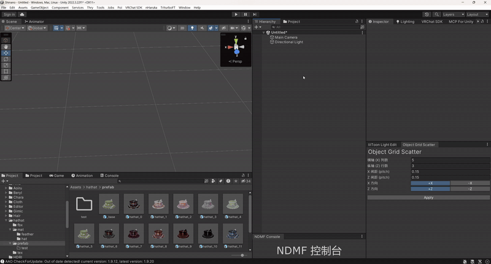

# ChangeMaterialToCreatePrefab

## What is this?

A small Unity Editor tool that batch-generates prefabs for a GameObject, each with only its materials swapped.

For example, a GameObject has 3 material slots and you have 10 material sets (30 materials in total). Doing it by hand means swapping materials 3x10=30 times.
With this tool, ideally you only need to (batch-)specify the GameObject twice and the materials 3 times.

## How to install?

The simplest way:
Drag [ChangeMaterialToCreatePrefab.cs](./Editor/ChangeMaterialToCreatePrefab.cs) into the `Editor` folder of your Unity project.

## How to use?

- `Tools - Change Materials To Create Prefab`
- Fill in the fields as the GUI instructs, then click Start
- The generated prefabs should now be in the `Save folder` you specified

Demo video (2x speed):

